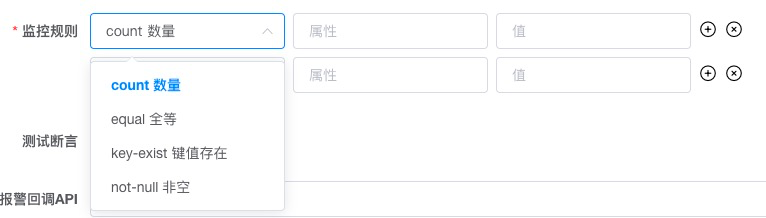

# ApiMonitor

## 1.采用GJSON方案，详情参考 https://github.com/tidwall/gjson
## 2.针对使用频率比较高的规则，设置了8种快捷方式



### 2.1 示例接口返回数据
```azure
{
"name": {"first": "Tom", "last": "Anderson"},
"age":37,
"children": ["Sara","Alex","Jack"],
"fav.movie": "Deer Hunter",
"friends": [
{"first": "Dale", "last": "Murphy", "age": 44, "nets": ["ig", "fb", "tw"], "status": 1},
{"first": "Roger", "last": "Craig", "age": 68, "nets": ["fb", "tw"], "status": 1},
{"first": "Jane", "last": "Murphy", "age": 47, "nets": ["ig", "tw"], "status": 1}
]
}
```

### 2.2，规则使用说明

| 规则名称 | 规则用途 | 规则使用说明 |
| :-----| :---- | :---- | 
| count 数量 | 判断键值的长度，是.#语法的便捷写法，<br>注意：键值需要是数组，否则验证不通过。 | 第一个文本框填写想要获取长度的键值，支持获取多级键值。<br><br> eg：<br>children  – 获取children字段长度，等价于children.#，同时也支持填写children.# <br><br>friends.0.nets – 获取friends第0个元素中nets字段的长度 <br><br>child*、c?ildren 都可以匹配到children <br><br>第二个文本框填写长度值，支持数值以及数值区间。 <br><br>4  - 数组长度为具体值4<br>[0-20] - 数组长度在0-20区间内 |
| equal 全等 | 判断键值存在，并且和预期值相等 | 第一个文本框填写想要判断的键值，支持获取多级键值。<br><br>eg：<br>age  – 取age的值<br>name.last – 取name的孩子节点last的值，上述示例数据获得键值："Anderson"<br>fav\.movie – 取fav.movie的值（键值中包含 ‘.’ 需要转义 ），上述示例数据获得键值："Deer Hunter"<br>friends.#.status – 取friends所有元素中status键值的值<br>第二个文本框填写等于的值，支持简单数据类型，number、string、boolean，以及 '或' 的关系。<br>0 - 值为0<br>(tom | bob) – 值为tom或者bob<br><br>注意需要兼容boolean类型的true和字符串true |
| key-exist 键值存在 | 判断键值是否存在 | 在第一个文本框中填写键值，支持获取多级键值。<br><br>eg：<br>name  – 判断name键值是否存在<br>friends.#.status  – 判断friends的所有元素是否都包含status键值 |
| not-null 非空 | 判断键的值不为空，不为：null，undefined，""空字符串 | 在第一个文本框中填写键值，支持获取多级键值。<br>name  – 判断name的值不为空<br>friends.#.status  – 判断friends的所有元素的status值都不为空 |
| not-equal 不等	 | 判断键值不存在，或者存在且不等于预期值| 第一个文本框填写想要判断的键值，支持获取多级键值。<br><br>eg：<br>age  – 取age的值<br>friends.#.status – 取friends所有元素中status键值的值<br><br>第二个文本框填写不等于的值，支持简单数据类型，number、string、boolean。<br>0 - 值不等于0 |
| include 包含	 | 判断键值数组包含预期值 | 第一个文本框填写想要判断的键值，必须为数组。<br><br>eg：<br>friends.#.status – 取friends所有元素中status键值的值<br><br>第二个文本框填写需要包含值，支持简单数据类型，number、string、boolean。<br>1 - 只要一个元素值为1即可 |
| gt 大于	 | 判断键值大于预期值 | 第一个文本框填写想要判断的键值，支持获取多级键值。<br><br>eg：<br>age  – 取age的值<br>friends.#.status – 取friends所有元素中status键值的值<br><br>第二个文本框填写大于的值，必须为nunber。<br>0 - 值大于0 |
| lt 小于	| 判断键值小于预期值 | 第一个文本框填写想要判断的键值，支持获取多级键值。<br><br>eg：<br>age  – 取age的值<br>friends.#.status – 取friends所有元素中status键值的值<br><br>第二个文本框填写小于的值，必须为nunber。<br>20 - 值小于20 |

### 2.3 报警使用说明

#### 支持多种报警方式包括 电话、短信、邮件、钉钉，支持回调，可以自定义报警方式，电话报警和短信报警需要付费，开源版本暂不展示

### 联系我
#### 目前还在迭代开发中，有兴趣可以联系微信：prejudiceandpride6